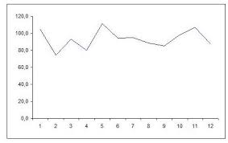
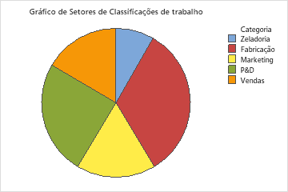
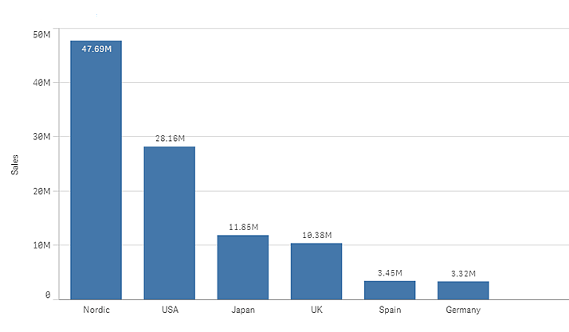
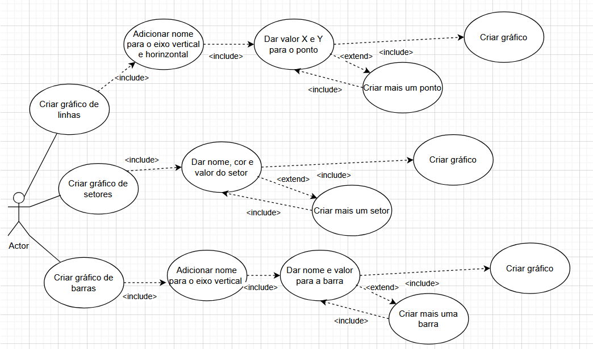

# Análise orientada a objeto
> [!NOTE]
> 
A <strong>análise</strong> orientada a objeto consiste na descrição do problema a ser tratado, duas primeiras etapas da tabela abaixo, a definição de casos de uso e a definição do domínio do problema.

## Descrição Geral do domínio do problema

Este programa permite que o usuário crie 3 tipos de gráficos. As imagens abaixo são ilustrativas e não são iguais a deste programa.

## Gráfico de Linha

    

Este gráfico é feito criando pontos em cordenadas verticais e horizontais e então uma linha liga estes pontos. É possível adicionar uma descrição nos eixos horizontais e verticais para maior entendimento do objetivo do gráfico.

## Gráfico de Setores 

    

Também conhecido como gráfico de pizza, um circúlo é dividido conforme as proporções dos valores dados. Cada valor é representado com uma cor, que é mostrada em uma legenda.

## Gráfico de Barras

    

É formado por barras verticais cujo a altura é proporcional ao valor dado. O nome ou descrição dela está em baixo no eixo horizontal, e o seu valor em cima, como demonstra a imagem. É possivel dar uma descrição ao eixo vertical, onde fica a escala.

## Diagrama de Casos de Uso

    

Detalhamento dos casos de uso:

- [UC1:](uc01.md)

 
## Diagrama de Domínio do problema

Elaborar um diagrama conceitual do domínio do problema.

[Retroceder](README.md) | [Avançar](projeto.md)

